<div align="center">


<h1>Event-Driven Architecture Lab</h1>

<p><strong>The Global Standard for Industrialized Asynchronous Systems and Eventing Orchestration</strong></p>

[]()
[]()
[]()
[]()

<br/>

> **"Industrializing asynchronous communication to enable real-time, decoupled, and infinitely scalable enterprise ecosystems."** 
> Event-Driven Architecture Lab (EDA-Lab) is a flagship repository designed to enable organizations to design, simulate, secure, and govern modern eventing systems through secure guardrails, pattern-driven blueprints, and multi-cloud reference architectures.

</div>

---

## 🏛️ Executive Summary

**Event-Driven Architecture Lab (EDA-Lab)** is a flagship repository designed for CIOs, CTOs, and Enterprise Architects. As organizations shift from monolithic silos to real-time, event-based ecosystems, the ability to orchestrate, simulate, and govern asynchronous communication becomes the critical competitive advantage.

This platform provides an industrialized approach to **Event-Driven Systems**, delivering production-ready **Messaging Patterns**, **Streaming Analytics Frameworks**, **CQRS/Event Sourcing Labs**, and **Reliability Engineering Blueprints**. It supports **Kafka**, **RabbitMQ**, **Azure Event Hubs**, **AWS EventBridge**, and **GCP Pub/Sub** at institutional scale, enabling organizations to transition from "Spaghetti Integration" to "Industrialized Event Fabrics."

---

## 💡 Why Event-Driven Architectures Matter

Event-Driven Architecture (EDA) is the "asynchronous engine" of the modern enterprise:
- **Loose Coupling**: Enabling teams to build, deploy, and scale services independently without direct dependencies.
- **Real-Time Agility**: Responding to business events (orders, telemetry, risk) as they happen, not hours later.
- **Elastic Scalability**: Handling massive traffic spikes through asynchronous buffers and competing consumer patterns.
- **Institutional Resilience**: Building systems that survive partial failures through dead-letter queues and retry mechanisms.

---

## 🚀 Business Outcomes

### 🎯 Strategic Business Impact
- **Increased Velocity**: Reducing time-to-market by allowing autonomous teams to consume events without coordination.
- **Cost Optimization**: Leveraging serverless event triggers and asynchronous scaling to minimize idle compute spend.
- **Improved Customer Experience**: Delivering instantaneous updates and reactive experiences through real-time event streams.
- **Deeper Business Insights**: Using streaming analytics to detect fraud, predict churn, and optimize supply chains in real-time.

---

## 🏗️ Technical Stack

| Layer | Technology | Rationale |
|---|---|---|
| **Simulation Engine** | Python (FastAPI), Node.js | High-performance orchestration of event producers, consumers, and traffic models. |
| **Messaging Fabric** | Kafka, RabbitMQ, Cloud Buses | Industry-standard brokers for high-throughput and low-latency asynchronous delivery. |
| **Frontend** | React 18, Vite | Premium portal for executive dashboards, throughput analytics, and simulation labs. |
| **Automation** | Terraform | Standardized Infrastructure as Code for multi-cloud broker and worker provisioning. |
| **Database** | PostgreSQL | Centralized repository for event metadata, simulation results, and institutional patterns. |
| **Observability** | Prometheus / Grafana | Real-time monitoring of producer rates, consumer lag, and end-to-end latency. |

---

## 📐 Architecture Storytelling: 90+ Diagrams

### 1. Executive High-Level Architecture
The holistic vision of the enterprise eventing journey.

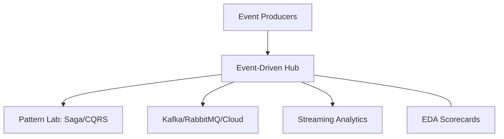

### 2. Detailed Platform Topology
The internal service boundaries and management layers of the industrialized lab.

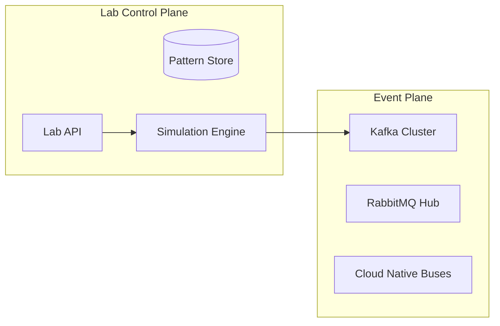

### 3. Producer to Consumer Request Path
Tracing the asynchronous journey of a single event from birth to consumption.

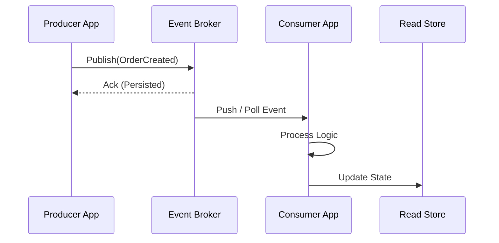

### 4. Event Control Plane
The "Brain" of the framework managing global institutional standards and pattern-as-code.

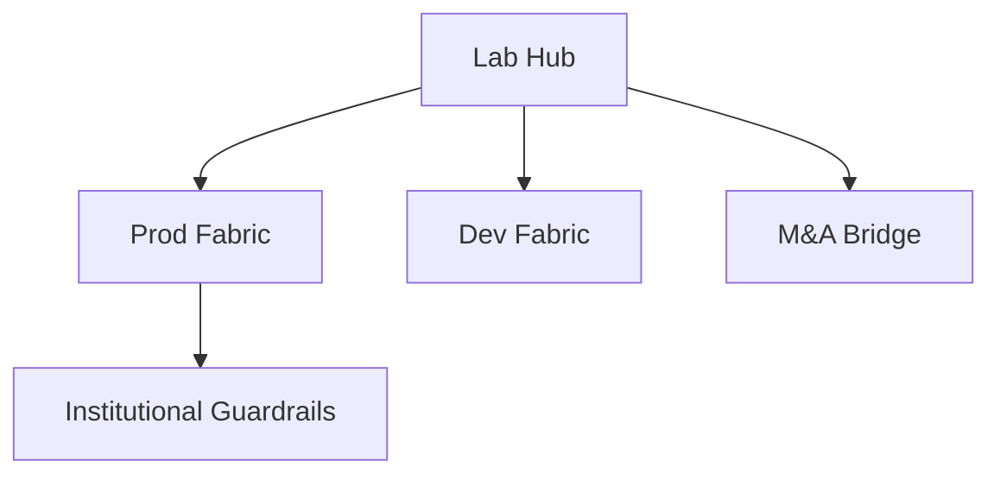

### 5. Multi-Cloud Topology
Synchronizing and bridging events across Azure, AWS, and GCP environments.

```mermaid
graph LR
    Azure[Event Hubs] <-> Bridge[Event Bridge] <-> AWS[EventBridge]
    Bridge <-> GCP[Pub/Sub]
```

### 6. Regional Deployment Model
Hosting event platform services close to the producers for low latency and high availability.

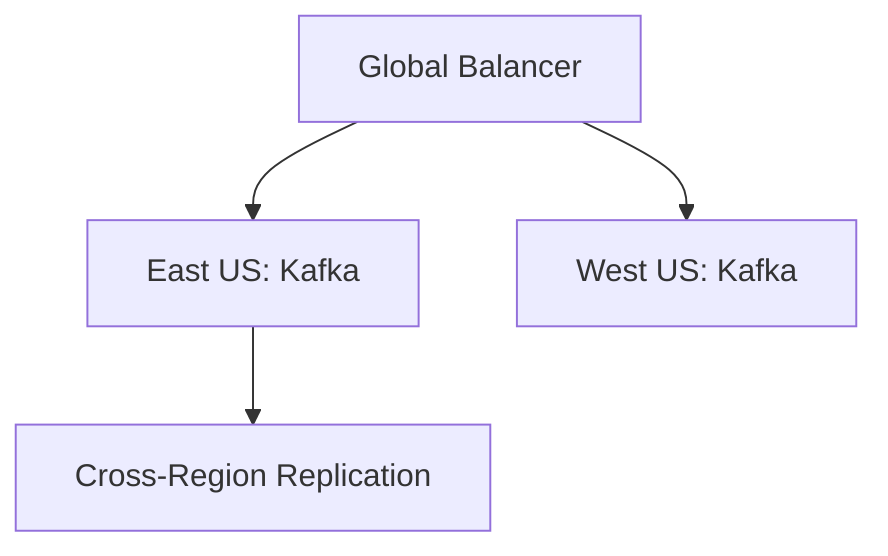

### 7. DR Failover Model
Ensuring platform continuity for critical asynchronous services and event archives.

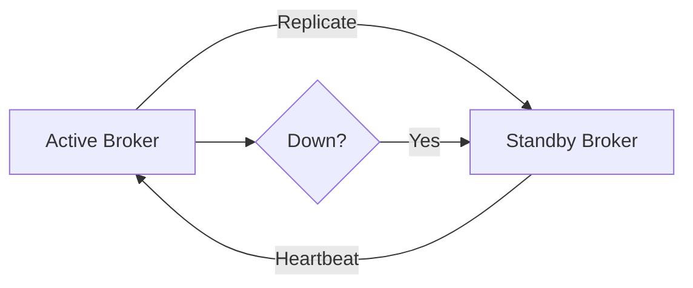

### 8. API Gateway Architecture
Securing and throttling the entry point for synchronous-to-asynchronous event submission.

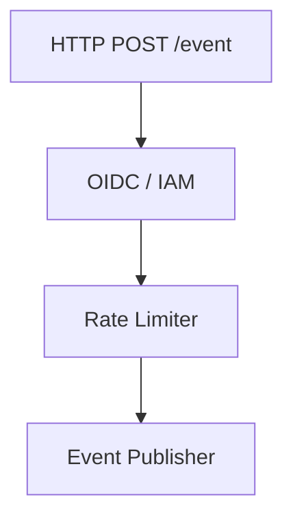

### 9. Queue Worker Architecture
Managing long-running consumer processes and complex event transformation tasks.

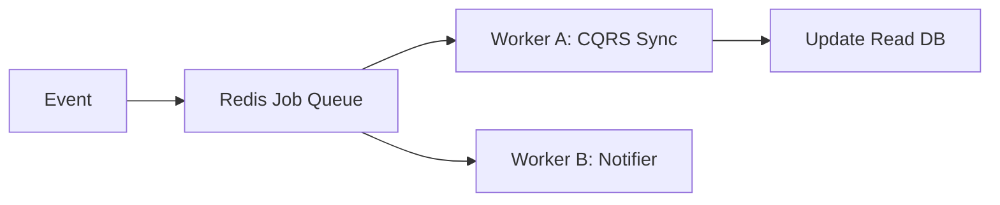

### 10. Dashboard Analytics Flow
How raw event telemetry becomes executive institutional readiness scorecards.

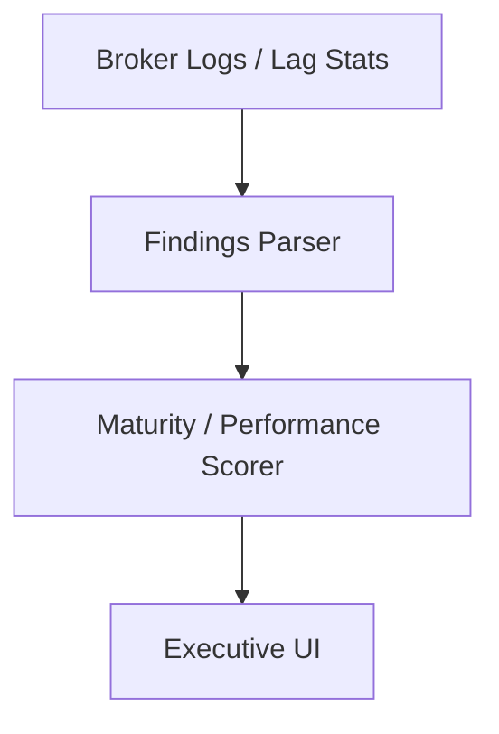

### 11. Pub/Sub Model
Standardizing one-to-many event distribution across the institutional estate.

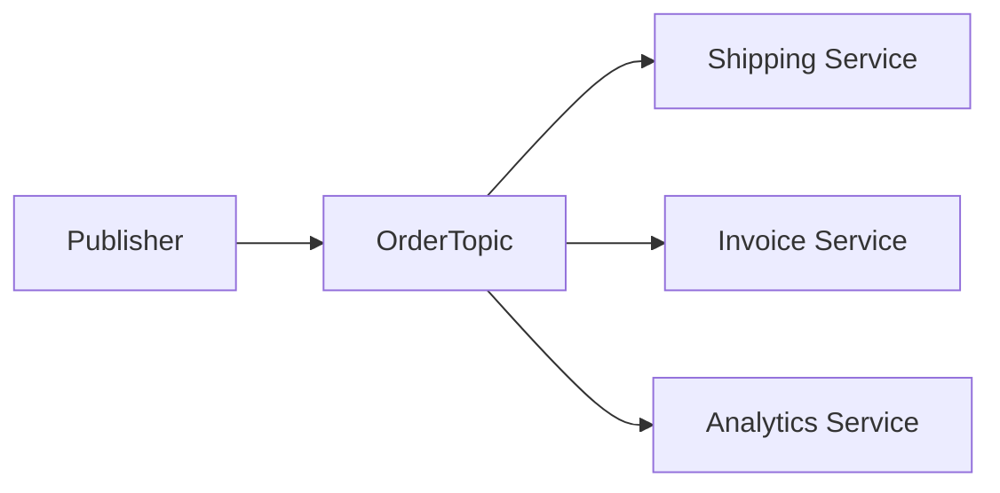

### 12. Point-to-Point Queue Model
Ensuring direct, reliable, and unique consumption of sensitive tasks.

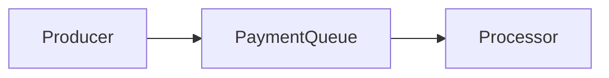

### 13. Fan-out Event Flow
Broadcasting a single business event to multiple downstream systems for parallel processing.

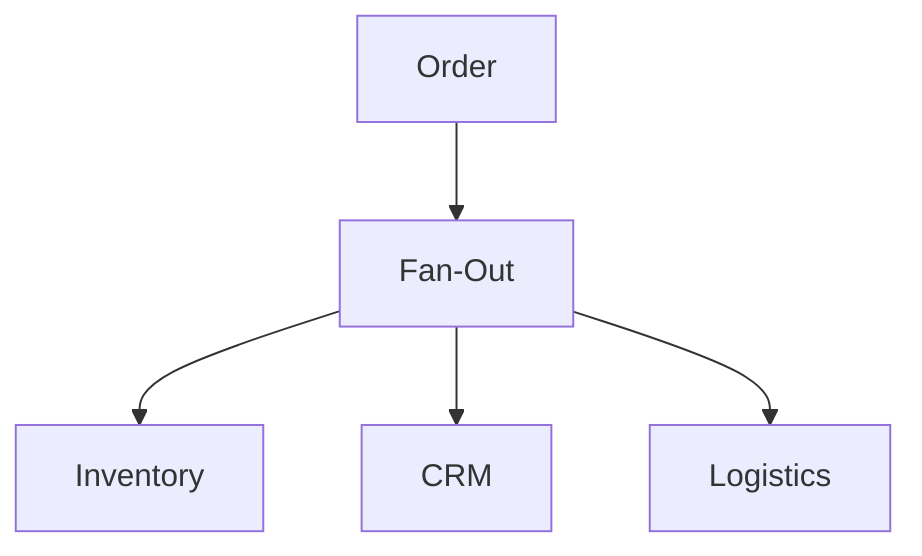

### 14. Competing Consumers Pattern
Scaling processing throughput by allowing multiple instances of a service to share a queue.

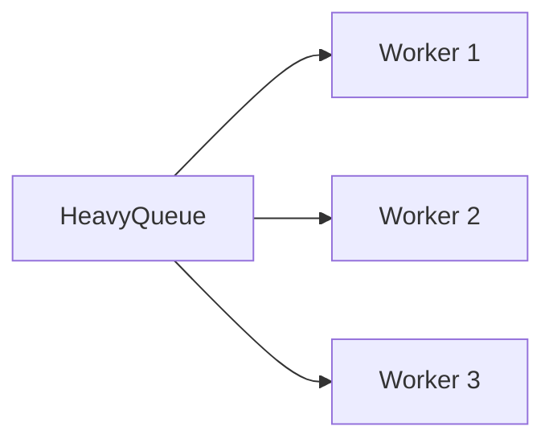

### 15. Dead Letter Queue Lifecycle
Managing the recovery and auditing of events that cannot be processed successfully.

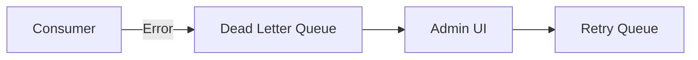

### 16. Retry with Backoff Workflow
Implementing resilient error handling to survive transient downstream failures.

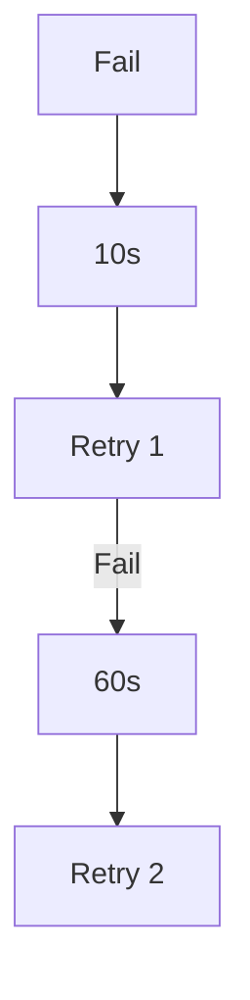

### 17. Saga Choreography Model
Coordinating distributed transactions through a chain of success/failure events.

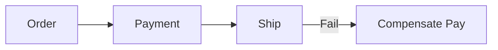

### 18. Saga Orchestration Model
Using a central coordinator to manage the state and transitions of complex distributed flows.

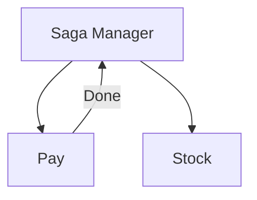

### 19. Request-Reply Async Flow
Enabling request-response behavior over asynchronous messaging for decoupling.

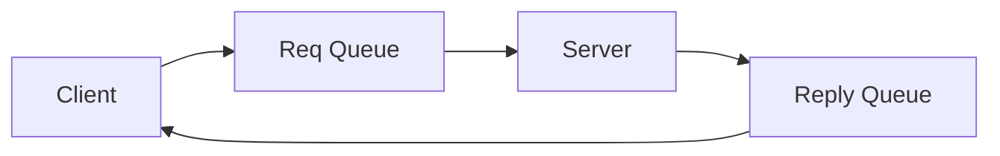

### 20. Event Notification Pattern
Sending lightweight signals that prompt downstream services to pull data.

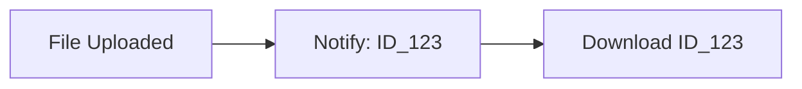

### 21. Domain Event Lifecycle
The journey of an event from a business domain state change to institutional broadcast.

```mermaid
graph TD
    Change[State Change] --> Capture[Domain Event] --> Publish[Messaging Hub]
```

### 22. Event Schema Evolution Model
Managing changes to event payloads without breaking downstream consumers.

```mermaid
graph LR
    V1[Schema v1] --> Registry[Schema Registry] --> V2[Schema v2]
```

### 23. Event Versioning Strategy
Handling multiple versions of the same event type during transition periods.

```mermaid
graph TD
    Prod[Prod v2] --> Hub[Hub]
    Hub --> Cons1[Cons v1: Map v2->v1]
    Hub --> Cons2[Cons v2: Native]
```

### 24. Event Sourcing Architecture
Treating the event stream as the primary source of truth for application state.

```mermaid
graph LR
    Event[Event Stream] --> State[Replay] --> App[Current State]
```

### 25. CQRS Read/Write Split
Decoupling the command (write) and query (read) paths for maximum performance.

```mermaid
graph TD
    Cmd[Write: Order] --> Stream[Event Hub] --> View[Read: Dashboard]
```

### 26. Outbox Pattern Workflow
Ensuring atomicity between database updates and event publishing.

```mermaid
graph LR
    App[App] --> DB[Local DB + Outbox]
    DB --> Relay[Relay Service] --> Broker[Kafka]
```

### 27. CDC to Event Stream Model
Automatically streaming database changes (inserts/updates) into event topics.

```mermaid
graph LR
    SQL[Legacy DB] --> Debezium[CDC Connector] --> Kafka[Kafka Topic]
```

### 28. Materialized View Refresh Flow
Updating read-optimized tables as relevant business events occur.

```mermaid
graph TD
    Ev[Order Event] --> Worker[Update Stats] --> Table[Stats Table]
```

### 29. Snapshotting Lifecycle
Improving event sourcing performance by periodically saving aggregate state.

```mermaid
graph LR
    Logs[1k Events] --> Snap[Snapshot at t=1000] --> Recovery[Fast Load]
```

### 30. Data Replay Model
Reprocessing historical event streams to populate new services or audit data.

```mermaid
graph TD
    Archive[Event Archive] --> Replay[Replay Engine] --> New[New Service]
```

### 31. Kafka Topic Topology
Architecting topics, partitions, and replication factors for scale.

```mermaid
graph LR
    Topic[Orders] --- P0[Partition 0]
    Topic --- P1[Partition 1]
```

### 32. Partitioning Strategy
Determining how events are distributed across partitions (e.g., by UserID).

```mermaid
graph TD
    Key[UserID: 123] --> Hash[Hash(123)] --> Part[P0]
```

### 33. Consumer Group Balancing
Scaling out consumption while ensuring every event is processed exactly once.

```mermaid
graph LR
    P0[P0] --> C1[Consumer A]
    P1[P1] --> C2[Consumer B]
```

### 34. Stream Processing Pipeline
Transforming, filtering, and enriching events in motion using KSQL or Flink.

```mermaid
graph LR
    Raw[Raw Stream] --> Filter[Filter] --> Enrich[Enrich] --> Output[Gold]
```

### 35. Windowed Aggregation Model
Calculating metrics (e.g., orders per hour) over sliding or tumbling time windows.

```mermaid
graph TD
    Stream[Events] --> Window[10m Window] --> Agg[Sum: 50]
```

### 36. Fraud Detection Event Flow
Using real-time event correlation to flag suspicious identity or payment patterns.

```mermaid
graph LR
    P1[Pay] <-> P2[Pay: High Val] --> Alert[Fraud Detected]
```

### 37. IoT Telemetry Stream Model
Ingesting and processing millions of sensor events per second.

```mermaid
graph TD
    Sensor[1M Devices] --> Ingest[Event Hubs] --> Process[Telemetry Hub]
```

### 38. Real-time Dashboard Workflow
Pushing event updates directly to end-user UIs via WebSockets or SSE.

```mermaid
graph LR
    Ev[New Order] --> Socket[WebSocket Server] --> UI[Admin Dashboard]
```

### 39. Alerting Event Pipeline
Triggering operational alerts when event patterns indicate system issues.

```mermaid
graph TD
    Lag[High Lag] --> Rule[Lag > 1k] --> Notify[PagerDuty]
```

### 40. Event Lakehouse Integration
Long-term archival of every institutional event for analytics and compliance.

```mermaid
graph LR
    Kafka[Kafka] --> Connector[S3 Connector] --> Lake[Delta Lake]
```

### 41. Azure Event Hubs Pattern
Implementing institutional event streaming on Azure.

```mermaid
graph LR
    Ingest[Event Hubs] --> Stream[Stream Analytics] --> Storage[Blob]
```

### 42. AWS EventBridge Integration
Architecting the serverless event bus for AWS-native ecosystems.

```mermaid
graph TD
    Event[App Event] --> Bus[EventBridge] --> Lambda[Trigger]
```

### 43. SQS + SNS Topology
Building robust async pipelines using AWS Simple Queue and Notification services.

```mermaid
graph LR
    Topic[SNS: Fan-out] --> Q1[SQS 1]
    Topic --> Q2[SQS 2]
```

### 44. GCP Pub/Sub Model
Leveraging Google Cloud's global asynchronous messaging service.

```mermaid
graph LR
    Pub[Publisher] --> Top[Topic] --> Sub[Push/Pull Sub]
```

### 45. Kubernetes Event Platform
Hosting brokers and consumers within a standardized K8s environment.

```mermaid
graph TD
    Pod[Producer Pod] --> Broker[Strimzi Kafka] --> Worker[Consumer Pod]
```

### 46. Serverless Event Trigger Flow
Automatically invoking compute functions based on event activity.

```mermaid
graph LR
    Q[Queue] --> Trigger[Trigger] --> Func[Azure Function]
```

### 47. Terraform Provisioning Model
Orchestrating the creation of multi-cloud eventing infrastructure.

```mermaid
graph TD
    TF[Terraform] --> Azure[Hubs]
    TF --> AWS[MSK]
```

### 48. Secrets Management Workflow
Securing broker credentials and connection strings via Key Vault.

```mermaid
graph LR
    App[App] --> KV[Key Vault] --> Conn[SAS Token] --> Broker[Hub]
```

### 49. Network Segmentation Model
Isolating event brokers within private VNETs/VPCs for security.

```mermaid
graph TD
    Private[Private Subnet: Broker] <-> Proxy[Gateway] <-> Public[Internet]
```

### 50. Multi-region Replication Flow
Ensuring event availability and low-latency access across global regions.

```mermaid
graph LR
    US[East US] <-> MirrorMaker[MirrorMaker 2] <-> EU[West EU]
```

### 51. OIDC / SSO Auth Flow
The foundation of modern institutional single sign-on for the lab portal.

```mermaid
graph LR
    User[Dev] --> SSO[Entra Auth] --> Portal[Lab Hub]
```

### 52. RBAC Model
Defining granular roles for EDA producers, consumers, and platform admins.

```mermaid
graph TD
    Role[Producer] --> Perm[Write to Topic]
```

### 53. mTLS Broker Communication
Enforcing mutual TLS for all service-to-broker interactions.

```mermaid
graph LR
    App[Client Cert] <-> Broker[Server Cert]
```

### 54. Encryption in Transit Model
Standardizing TLS 1.2+ for every eventing connection.

```mermaid
graph TD
    Plain[Data] --> TLS[TLS Wrap] --> Secure[Wire]
```

### 55. Audit Logging Architecture
Capturing every publish, subscribe, and management action for auditing.

```mermaid
graph LR
    Action[Publish] --> Log[Audit Log] --> Sentinel[SIEM]
```

### 56. Metrics Pipeline
Transforming broker telemetry into real-time throughput and lag metrics.

```mermaid
graph TD
    App[Broker] --> Prom[Prometheus] --> Graf[Grafana]
```

### 57. Logging Architecture
The multi-layered approach to capturing EDA operational events.

```mermaid
graph LR
    Log[Log] --> Forwarder[Fluent] --> Hub[Loki/Monitor]
```

### 58. Tracing Model
Observing event chains across microservices via OpenTelemetry.

```mermaid
graph TD
    SpanA[Prod] --> SpanB[Broker] --> SpanC[Cons]
```

### 59. Backpressure Management Workflow
Ensuring consumers are not overwhelmed by massive event surges.

```mermaid
graph TD
    High[Load High] --> Slow[Pause Poll] --> Drain[Process Existing]
```

### 60. Circuit Breaker Model
Preventing cascading failures when downstream event consumers are down.

```mermaid
graph LR
    Open[Open] <-> Closed[Closed]
```

### 61. Executive KPI Review Cycle
Reporting EDA performance and ROI to the Board and C-suite.

```mermaid
graph TD
    Stats[Throughput] --> Deck[Executive Summary]
```

### 62. Throughput Scorecard
Measuring the platform's ability to handle millions of events per second.

```mermaid
graph LR
    In[1M/s] --- Out[0.98M/s]
```

### 63. Latency Heatmap Model
Visualizing end-to-end event delivery times across global regions.

```mermaid
graph TD
    Fast[<10ms] --> Slow[>1s]
```

### 64. Cost Allocation Workflow
Attributing cloud messaging costs to specific business units and products.

```mermaid
graph LR
    Bill[Cloud Bill] --> Dept[Finance] --> Cost[EDA Portion]
```

### 65. Capacity Planning Model
Forecasting future broker and storage needs based on event growth trends.

```mermaid
graph TD
    Now[10TB] --> Year1[50TB]
```

### 66. Team Benchmark Comparison
Comparing the EDA maturity and efficiency of different product teams.

```mermaid
graph TD
    TeamA[Elite] <-> TeamB[Scaling]
```

### 67. Quarterly Roadmap Cadence
Reviewing the EDA platform's evolution and alignment with business goals.

```mermaid
graph TD
    Q1[Foundations] --> Q4[Advanced Mesh]
```

### 68. Vendor Governance Workflow
Managing the lifecycle and security of external messaging services.

```mermaid
graph LR
    Eval[Eval] --> Approved[Onboard] --> Monitor[Audit]
```

### 69. Event Maturity Roadmap
The journey from "Basic Queuing" to "Institutional Event Mesh."

```mermaid
graph LR
    S1[Simple] --> S4[Elite Mesh]
```

### 70. Continuous Improvement Loop
The engine for evolving EDA based on real-world throughput and reliability data.

```mermaid
graph LR
    Watch[Monitor] --> Adapt[Pattern Update]
```

### 71. AI Event Enrichment Flow
Using machine learning to automatically add context and metadata to events.

```mermaid
graph LR
    Raw[Event] --> AI[Model] --> Enrich[Contextual Event]
```

### 72. Digital Twin Event Model
Synchronizing physical assets with digital representations via telemetry.

```mermaid
graph TD
    Robot[Physical] --> Twin[Digital Event]
```

### 73. Multi-country Operating Model
Managing data residency and compliance for cross-border eventing.

```mermaid
graph LR
    EU[EU Hub] <-> Filter[GDPR Filter] <-> US[US Hub]
```

### 74. Regulated Event Retention Pattern
Architecture for long-term storage of events for regulatory compliance (7+ years).

```mermaid
graph TD
    Hot[Active: 7d] --> Cold[Archive: 7y]
```

### 75. Hybrid Datacenter Bridge Model
Connecting legacy on-prem MQ to modern cloud-native event buses.

```mermaid
graph LR
    OnPrem[RabbitMQ] <-> Bridge[VPN/ExpressRoute] <-> Cloud[Kafka]
```

### 76. Edge Event Mesh Architecture
Deploying lightweight event brokers to the factory floor or retail edge.

```mermaid
graph TD
    Edge[Store 1] --> HQ[Regional Hub]
```

### 77. Blockchain Event Notarization
Using DLT to provide immutable proof of critical business event occurrence.

```mermaid
graph LR
    Ev[Sign Contract] --> Hash[Chain Hash]
```

### 78. Identity Federation Model
Propagating user identity and context through asynchronous event chains.

```mermaid
graph TD
    Auth[JWT] --> Event[Payload + ID] --> Cons[Verify]
```

### 79. M&A Integration Event Bus
Rapidly connecting acquired companies through a shared eventing layer.

```mermaid
graph LR
    HQ[HQ] <-> Bus[Common Hub] <-> Acq[New Sub]
```

### 80. Innovation Portfolio Roadmap
Planning the next 36 months of EDA platform evolution.

```mermaid
graph TD
    Now[Now] --> Year3[AI-Native EDA]
```

### 81. Queue Depth Lifecycle
Monitoring the number of pending events as a primary health indicator.

```mermaid
graph LR
    Low[Healthy] --> High[Backlog Spike]
```

### 82. Poison Message Handling Flow
Automatically isolating events that cause consumer crashes.

```mermaid
graph TD
    Cons[Crash] --> Detect[3 Retries] --> DLQ[Quarantine]
```

### 83. Topic Retention Governance
Standardizing how long events are kept based on business and cost requirements.

```mermaid
graph LR
    Log[Log] --> Expire[TTL: 7d] --> Purge[Delete]
```

### 84. Consumer Lag Remediation Model
Automated scaling of consumers when they fall behind producer rates.

```mermaid
graph TD
    Lag[Lag > 10k] --> KEDA[Auto-Scaler] --> Pods[Add 5 Pods]
```

### 85. Blue/green Broker Upgrade Flow
Upgrading messaging infrastructure without downtime or message loss.

```mermaid
graph LR
    Green[v2.8] --> Switch[LB Swap] --> Blue[v3.0]
```

### 86. Chaos Testing Workflow
Deliberately injecting broker failures to validate system resilience.

```mermaid
graph TD
    Inject[Kill Broker] --> Verify[Sagas Recover]
```

### 87. Backup Recovery Model
Restoring eventing state and topics after a catastrophic cloud failure.

```mermaid
graph LR
    Fail[Disaster] --> Restore[Terraform] --> Replay[Archives]
```

### 88. Change Management Workflow
Standardizing changes to critical topics, schemas, and configurations.

```mermaid
graph TD
    Req[Req] --> Review[Review] --> Approve[Deploy]
```

### 89. Tenant Baseline Comparison
Comparing the eventing posture of multiple tenants against a gold standard.

```mermaid
graph TD
    Baseline[Gold] <-> T1[Tenant A] <-> T2[Tenant B]
```

### 90. Event Mesh Topology
The ultimate architecture for global, decoupled, and intelligent eventing.

```mermaid
graph LR
    NodeA[Node] <-> NodeB[Node] <-> NodeC[Node]
```

---

## 🔬 EDA Lab Methodology

### 1. The Lab Pillars
Our platform is built on four core pillars:
- **Asynchronicity**: Decoupling services to enable independent scale and failure.
- **Pattern-First**: Building on proven models like Saga, CQRS, and Outbox.
- **Observability**: Measuring what matters (Lag, Throughput, End-to-end Latency).
- **Governance**: Standardizing schemas and retention across the institutional estate.

### 2. Eventing vs APIs
We provide a strategic framework for choosing between synchronous APIs (for immediate feedback) and asynchronous events (for long-running, resilient, or high-scale flows).

---

## 🚦 Getting Started

### 1. Prerequisites
- **Docker Desktop** & **Kubernetes** (minikube/kind).
- **Terraform** & **Python** (3.11+).
- **Kafka** & **RabbitMQ** (local or cloud instances).

### 2. Local Setup
```bash
# Clone the repository
git clone https://github.com/Devopstrio/event-driven-architecture-lab.git
cd event-driven-architecture-lab

# Start the EDA Control Plane & Simulation Engine
docker-compose up --build
```
Access the Portal at `http://localhost:3000`.

---

## 🛡️ Governance & Security
- **Security by Design**: Deep integration with mTLS and OIDC for broker access.
- **Resilience Ready**: Pre-configured DLQ and circuit breaker patterns.
- **Audit Ready**: Built-in evidence generation for asynchronous compliance audits.

---
<sub>&copy; 2026 Devopstrio &mdash; Engineering the Future of Industrialized Event-Driven Architecture.</sub>
