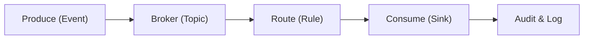
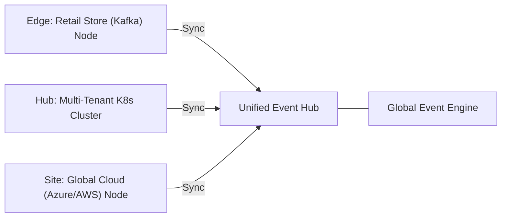
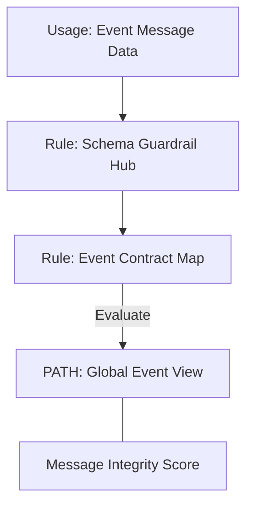
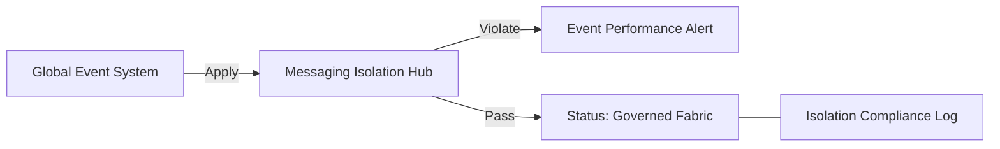
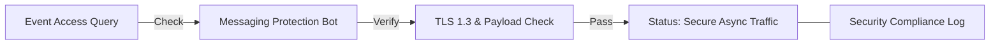
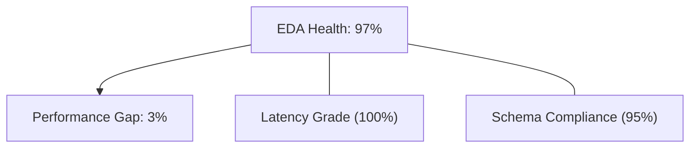
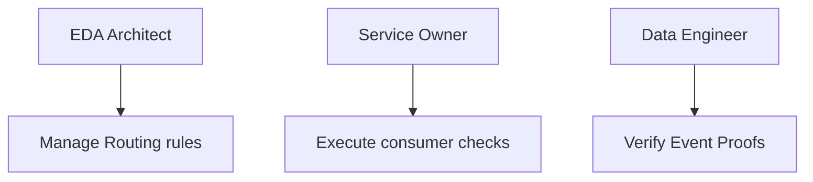
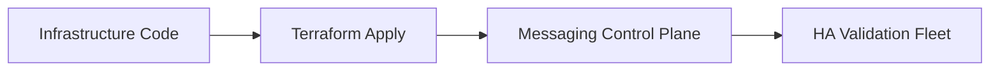
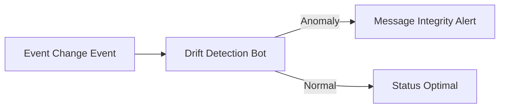
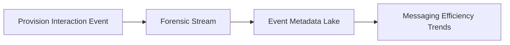

<div align="center">


<h1>Event-Driven Architecture Lab</h1>

<p><strong>The Institutional-Grade Platform for Asynchronous Systems, Event-Driven Governance, and Multi-Cloud Messaging Orchestration.</strong></p>

[]()
[]()
[]()

<br/>

> **"Industrializing asynchronous communication to automate real-time event fabrics."** 
> **Event-Driven Architecture Lab (EDA-Lab)** is an enterprise-grade platform designed to provide a secure, measurable, and highly automated foundation for global eventing operations. It orchestrates the complex lifecycle of events—from producer ingestion and topic brokerage to route-driven consumption and unified event auditing.

</div>

---

## 🏛️ Executive Summary

Fragmented messaging silos and manual integration workflows are strategic operational liabilities; lack of centralized event orchestration is a primary barrier to organizational cloud maturity. Organizations fail to maintain a secure asynchronous foundation not because of a lack of brokers, but because of fragmented eventing standards, lack of automated schema validation, and an inability to orchestrate event planes with operational precision.

This platform provides the **Event-Driven Intelligence Plane**. It implements a complete **Enterprise EDA-Lab-as-Code Framework**, enabling Architects and Platform teams to manage global eventing as first-class citizens. By automating the identification of throughput bottlenecks through real-time telemetry analysis and orchestrating the deployment of secure performance-driven event policies, we ensure that every organizational service—from core microservices clusters to distributed edge locations—is governed by default, audited for history, and strictly aligned with institutional asynchronous frameworks.

---

## 📐 Architecture Storytelling: Principal Reference Models

### 1. Principal Architecture: Global Event-Driven Architecture & Messaging Intelligence Plane
This diagram illustrates the end-to-end flow from event ingestion and multi-cloud orchestration to schema enforcement, performance validation, and institutional event auditing.


```mermaid
graph LR
    %% Subgraph Definitions
    subgraph EventIngress["Producer & Payload Ingress"]
        direction TB
        Microservices["Core Banking / Retail / App Svc"]
        IoT_Devices["Managed Edge / Factory / Retail Sensors"]
        Cloud_Buses["Azure / AWS / GCP Native Producers"]
    end

    subgraph IntelligenceEngine["Event Intelligence Hub"]
        direction TB
        API["FastAPI EDA Gateway"]
        EventOrchestrator["Global Topic & Routing Hub"]
        SchemaGuard_Hub["Schema Registry & Contract Hub"]
        AIOps_Validator["Throughput & Latency Analysis Hub"]
    end

    subgraph OperationsPlane["Distributed Messaging Fleet"]
        direction TB
        KafkaClusters["Managed High-Throughput Kafka"]
        CloudBridges["Managed Multi-Cloud Event Bridges"]
        ConsumerSinks["Managed Distributed Sink Clusters"]
    end

    subgraph OperationsHub["Institutional Event Hub"]
        direction TB
        Scorecard["EDA Maturity Scorecard"]
        Analytics["Event Flow & Payload Velocity Stats"]
        Audit["Forensic Event Metadata Lake"]
    end

    subgraph DevOps["EDA-Lab-as-Code Framework"]
        direction TB
        TF["Terraform Messaging Modules"]
        DriftBot["Event & Config Drift Validator"]
        ChatOps["Event Operations Hub"]
    end

    %% Flow Arrows
    EventIngress -->|1. Submit Event| API
    API -->|2. Orchestrate Brokerage| EventOrchestrator
    EventOrchestrator -->|3. Apply Schema Policy| SchemaGuard_Hub
    SchemaGuard_Hub -->|4. Assess Drift| AIOps_Validator
    
    AIOps_Validator -->|5. Execute Provision| OperationsPlane
    OperationsPlane -->|6. Notify Status| ChatOps
    API -->|7. Visualize Health| Scorecard
    
    Scorecard -->|8. Track Maturity| Analytics
    Scorecard -->|9. Record Provision| Audit
    
    TF -->|10. Provision Backbone| IntelligenceEngine
    DriftBot -->|11. Inject Throughput Risk| EventOrchestrator
    Audit -->|12. Improve Operations| KafkaClusters

    %% Styling
    classDef ingress fill:#f5f5f5,stroke:#616161,stroke-width:2px;
    classDef intel fill:#e8eaf6,stroke:#1a237e,stroke-width:2px;
    classDef operations fill:#e1f5fe,stroke:#01579b,stroke-width:2px;
    classDef ops fill:#ede7f6,stroke:#311b92,stroke-width:2px;
    classDef devops fill:#e8f5e9,stroke:#1b5e20,stroke-width:2px;

    class EventIngress ingress;
    class IntelligenceEngine intel;
    class OperationsPlane operations;
    class OperationsHub ops;
    class DevOps devops;
```

### 2. The EDA Lifecycle Flow
The continuous path of an asynchronous event from initial produce (event) and broker (topic) to active route (rule), consume (sink), and institutional forensic auditing.


```mermaid
graph LR
    Produce["Produce (Event)"] --> Broker["Broker (Topic)"]
    Broker --> Route["Route (Rule)"]
    Route --> Consume["Consume (Sink)"]
    Consume --> Audit["Audit & Log"]
```

### 3. Distributed Event Mesh Topology
Strategically orchestrating asynchronous events across global cloud regions, microservices clusters, and edge locations, providing a unified institutional view of global event health and messaging readiness.


```mermaid
graph LR
    RegionA["Edge: Retail Store (Kafka) Node"] -->|Sync| Hub["Unified Event Hub"]
    Cluster["Hub: Multi-Tenant K8s Cluster"] -->|Sync| Hub
    Global["Site: Global Cloud (Azure/AWS) Node"] -->|Sync| Hub
    Hub --- Logic["Global Event Engine"]
```

### 4. Schema Governance & High-Trust Data Plane Protection Flow
Executing complex logic for securing the bridge between event producers and schema registries, ensuring every organizational identity is verified and every asynchronous access is according to institutional standards.


```mermaid
graph TD
    Payload["Usage: Event Message Data"] --> Bridge["Rule: Schema Guardrail Hub"]
    Bridge --> ContractMap["Rule: Event Contract Map"]
    ContractMap -->|Evaluate| Context["PATH: Global Event View"]
    Context --- Estimate["Message Integrity Score"]
```

### 5. Multi-Cloud Event Federation & Governance Flow
Automatically managing unified event streams across Azure Event Grid, AWS EventBridge, and GCP Pub/Sub, ensuring institutional data residency and security boundaries by default.


```mermaid
graph LR
    Org["Global Event System"] -->|Apply| Guard["Messaging Isolation Hub"]
    Guard -->|Violate| Alert["Event Performance Alert"]
    Guard -->|Pass| Verify["Status: Governed Fabric"]
    Verify --- Audit["Isolation Compliance Log"]
```

### 6. Encryption & Perimeter Protection Flow (EDA Standard)
Managing the lifecycle of an asynchronous request, automatically enforcing institutional TLS 1.3 and payload encryption standards as required by security policy, ensuring zero-latency security confidence.


```mermaid
graph LR
    EventReq["Event Access Query"] -->|Check| Gatekeeper["Messaging Protection Bot"]
    Gatekeeper -->|Verify| TLS["TLS 1.3 & Payload Check"]
    TLS -->|Pass| Admit["Status: Secure Async Traffic"]
    Admit --- Audit["Security Compliance Log"]
```

### 7. Institutional EDA Maturity Scorecard
Grading organizational performance based on key indicators: Event Latency Grade, Schema Compliance Index, and Dead-Letter Recovery Index.


```mermaid
graph TD
    Post["EDA Health: 97%"] --> Risk["Performance Gap: 3%"]
    Post --- C1["Latency Grade (100%)"]
    Post --- C2["Schema Compliance (95%)"]
```

### 8. Identity & RBAC for Event Governance
Managing fine-grained access to eventing hubs, provisioning workers, and audit logs between EDA Architects, Service Owners, and Data Engineers.


```mermaid
graph TD
    Architect["EDA Architect"] --> Hub["Manage Routing rules"]
    Owner["Service Owner"] --> Exec["Execute consumer checks"]
    Engineer["Data Engineer"] --> Audit["Verify Event Proofs"]
```

### 9. IaC Deployment: EDA-Lab-as-Code Framework
Using modular Terraform to deploy and manage the versioned distribution of the messaging tracking hubs, consumer protection workers, and forensic metadata lakes.


```mermaid
graph LR
    HCL["Infrastructure Code"] --> TF["Terraform Apply"]
    TF --> Engine["Messaging Control Plane"]
    Engine --> Clusters["HA Validation Fleet"]
```

### 10. AIOps Event Drift & Anomaly Validation Flow
Using advanced analytics to identify sudden surges in event volume, unauthorized schema changes, suspicious configuration drifts, or unusual messaging pattern changes that could result in institutional risk.


```mermaid
graph LR
    Drift["Event Change Event"] --> Analyzer["Drift Detection Bot"]
    Analyzer -->|Anomaly| Alert["Message Integrity Alert"]
    Analyzer -->|Normal| Pass["Status Optimal"]
```

### 11. Metadata Lake for Forensic Event Audit
Storing long-term records of every event type (metadata), every routing change recorded, and every message event for institutional record-keeping, compliance auditing, and post-provisioning forensics.


```mermaid
graph LR
    Provision["Provision Interaction Event"] --> Stream["Forensic Stream"]
    Stream --> Lake["Event Metadata Lake"]
    Lake --> Trends["Messaging Efficiency Trends"]
```

---

## 🏛️ Core Governance Pillars

1.  **Unified Foundation Coordination**: Maximizing resilience by centralizing all messaging measurement through a single institutional plane.
2.  **Automated Broker Provisioning**: Eliminating "manual eventing" scenarios through proactive orchestration and pattern verification.
3.  **Sequential Routing Intelligence**: Ensuring zero-interruption operations through dependency-aware routing-driven messaging engineering.
4.  **Zero-Trust Payload Protection**: Automatically enforcing identity-based access and rule evaluation across all asynchronous tiers.
5.  **Autonomous Operations Logic**: Guaranteeing reliability through automated industry-specific messaging monitoring runbooks.
6.  **Full Event Auditability**: Immutable recording of every routing change and event provision for institutional forensics.

---

## 🛠️ Technical Stack & Implementation

### Messaging Engine & APIs
*   **Framework**: Python 3.11+ / FastAPI.
*   **Performance Engine**: Custom Python-based logic for multi-cloud event provisioning and DORA-style throughput metrics.
*   **Integrations**: Native connectors for Kafka, RabbitMQ, Azure Event Hubs, and AWS EventBridge.
*   **Persistence**: PostgreSQL (Messaging Ledger) and Redis (Live Event State).
*   **Auth Orchestrator**: Federated OIDC/SAML for least-privilege messaging management access.

### Governance Dashboard (UI)
*   **Framework**: React 18 / Vite.
*   **Theme**: Dark, Emerald, Indigo (Modern high-fidelity asynchronous aesthetic).
*   **Visualization**: D3.js for event topologies and Recharts for throughput velocity analytics.

### Infrastructure & DevOps
*   **Runtime**: AWS EKS or Azure Kubernetes Service (AKS) for management plane.
*   **Messaging Hub**: Managed event sourcing for immutable messaging security timeline reconstruction.
*   **IaC**: Modular Terraform for deploying the EDA landing zone and validation fleet.

---

## 🏗️ IaC Mapping (Module Structure)

| Module | Purpose | Real Services |
| :--- | :--- | :--- |
| **`infrastructure/messaging_hub`** | Central management plane | EKS, PostgreSQL, Redis |
| **`infrastructure/enforcers`** | Distributed messaging provisioners | Kafka, RabbitMQ, Cloud APIs |
| **`infrastructure/event_pipes`** | Messaging Ingestion Hubs | Webhooks, Lambda |
| **`infrastructure/auditing`** | Forensic event sinks | S3, Athena, Quicksight |

---

## 🚀 Deployment Guide

### Local Principal Environment
```bash
# Clone the landing zone platform
git clone https://github.com/devopstrio/event-driven-architecture-lab.git
cd event-driven-architecture-lab

# Configure environment
cp .env.example .env

# Launch the EDA stack
make init

# Trigger a mock event publication and automated schema validation simulation
make simulate-event
```

Access the Management Portal at `http://localhost:3000`.

---

## 📜 License
Distributed under the MIT License. See `LICENSE` for more information.

---
<div align="center">
  <p>© 2026 Devopstrio. All rights reserved.</p>
</div>
